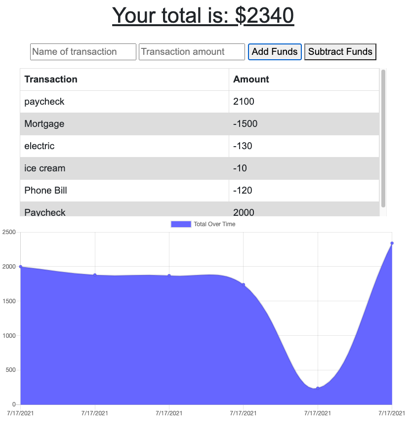

<h1 align="center">Budget Tracker</h1>
<p align="center">Progressive Web Applications (PWA) Demonstration</p>

<p align="center">
    
    
    
</p>
  
<p align="center">
    
    
    
  
  
</p>

## Discrption

Budget tracker allows users to add expenses and deposits to a budget with or without a network connection. Users will also be able to download Budget Tracker and use it locally due to itsa progressive nature (PWA).

## User Story

The following is an example of a how a user might like to use this application:

```
AS AN avid traveler
I WANT to be able to track my withdrawals and deposits with or without a data/internet connection
SO THAT my account balance is accurate when I am traveling 
```

## Application Functioanlity

The following is the funcatioanlity that the application will consist of based on the users requests mentioned above in User Story:

```
GIVEN a budget tracker without an internet connection
WHEN the user inputs an expense or deposit
THEN they will receive a notification that they have added an expense or deposit
WHEN the user reestablishes an internet connection
THEN the deposits or expenses added while they were offline are added to their transaction history and their totals are updated
```

## Snapshot
Click [here](https://mighty-inlet-00302.herokuapp.com/) to run Budget Tracker in the browser for a full demonstration.



## Contibutions

[Kyle Wilson](https://github.com/lylekilson)
